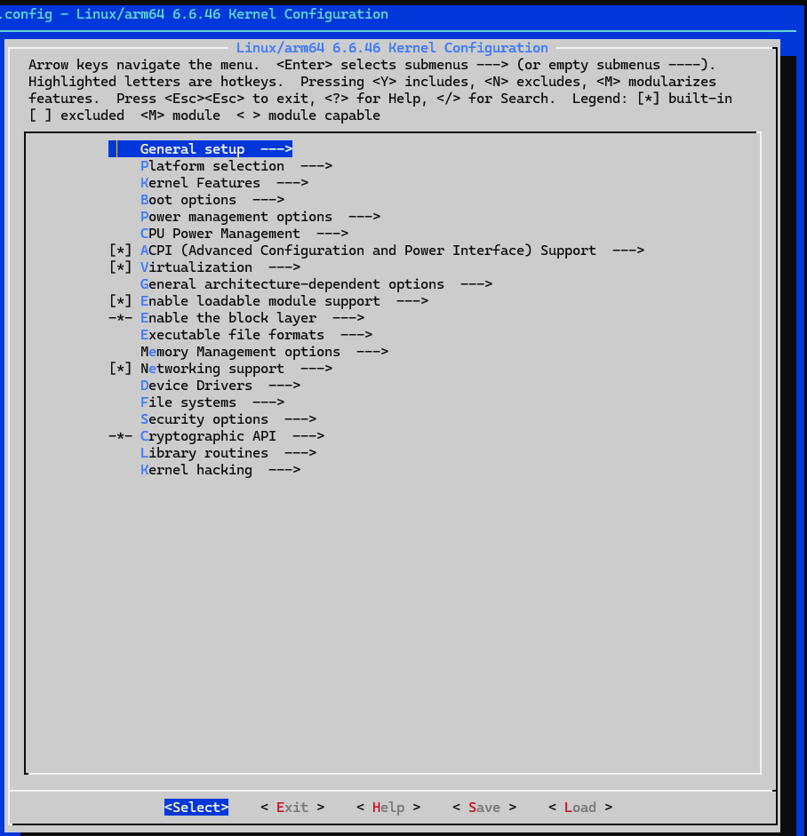
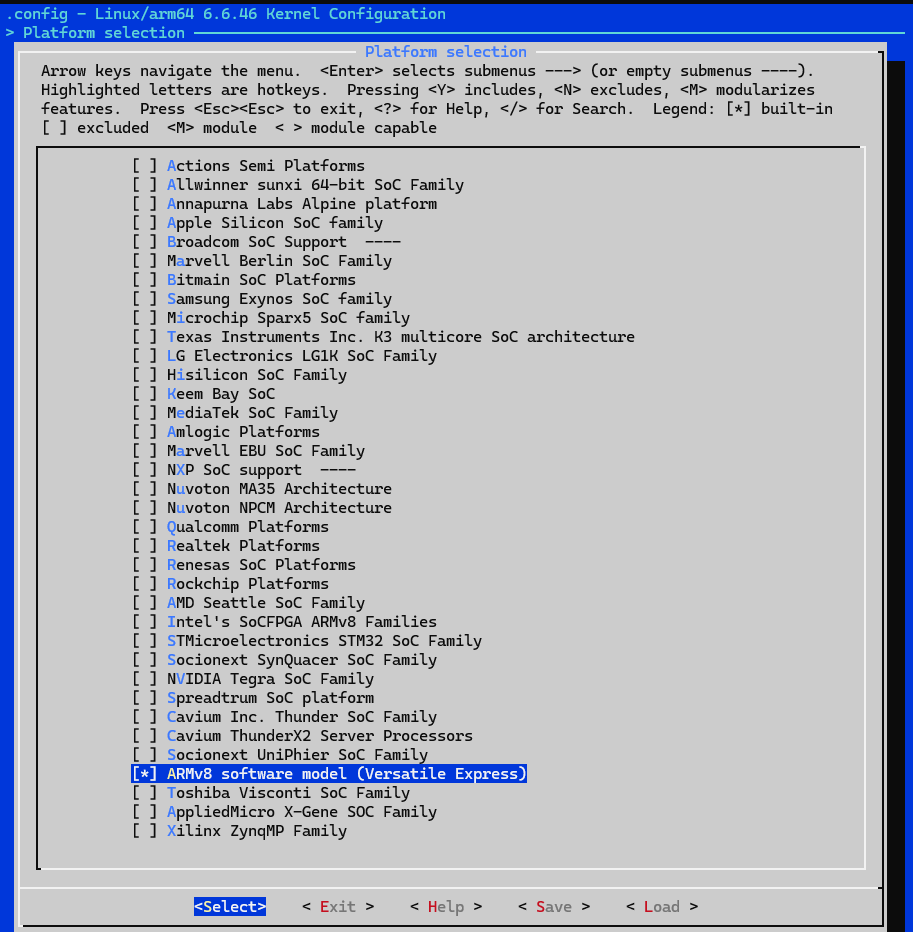
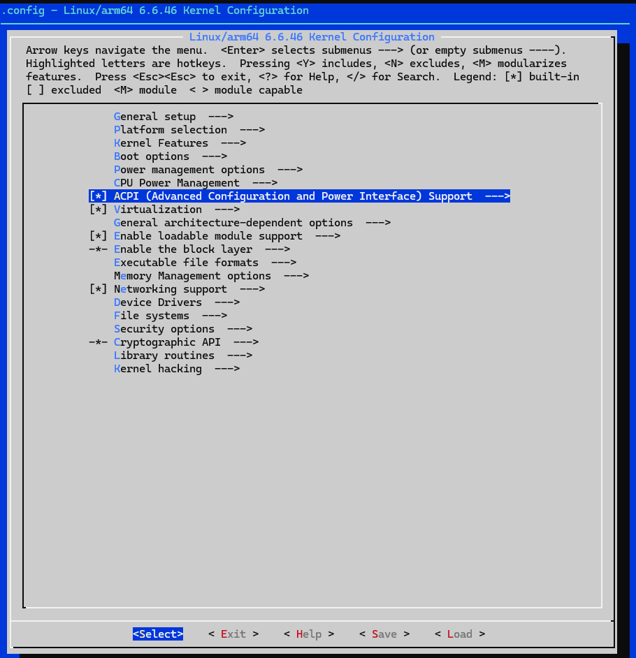
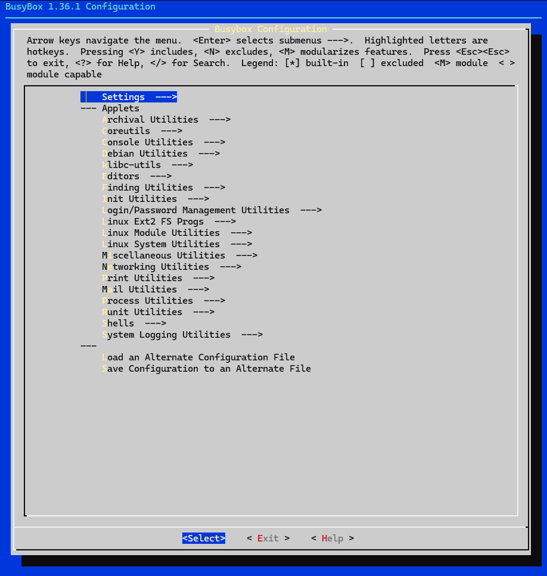
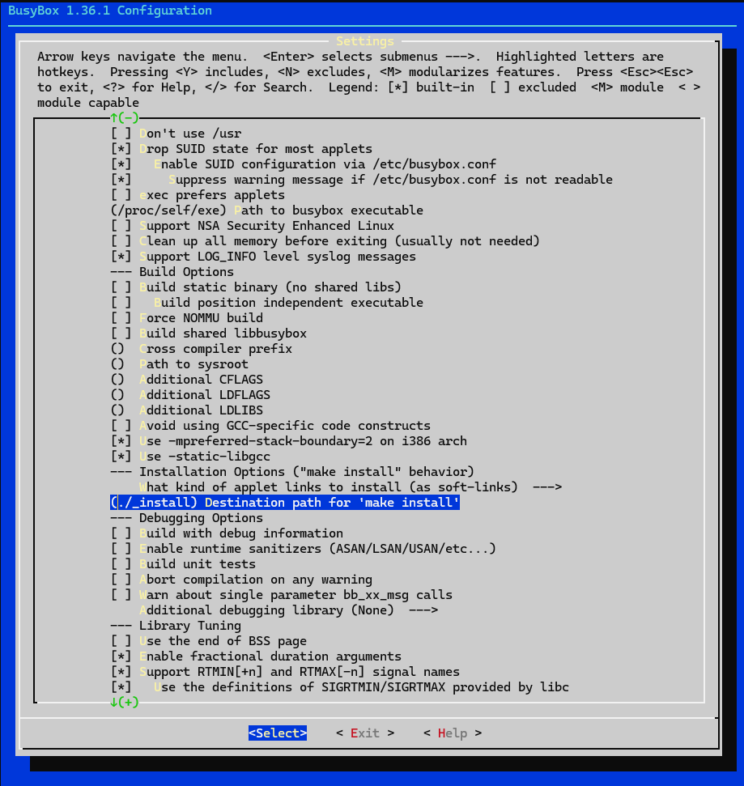

# Minimal-Linux-arm64
This repository documents bring-up of a minimal, custom ARM64 Linux system booted on QEMU.

The project covers the full low-level workflow, including:
- Cross-compiling a custom Linux kernel for ARM64
- Building and installing BusyBox as the user space
- Manually assembling a root filesystem 
- Creating required device nodes
- Booting the system on QEMU’s `virt` machine
- Launching an interactive root shell without a bootloader

The goal of this project is to demonstrate a clear understanding of
embedded Linux fundamentals, kernel–userspace interaction.

## Technical Requirements
This project was built and tested on a Linux host system using the following
tools and components.

- Host Environment - Ubuntu 24.04
- QEMU (emulator for the target architecture ARM64)
- Cross-compilation toolchain:  **aarch64-buildroot-linux-gnu**
- Kernel source: **linux-stable**
- Kernel version: **v6.6.46 (LTS)**

## Toolchain installation
A pre-built toolchain from Bootlin has been used in this project. Bootlin' toolchains are built using Buildroot.

To download the pre-built cross toolchain on host environment:

```
$ wget https://toolchains.bootlin.com/downloads/releases/toolchains/aarch64/tarballs/aarch64--glibc--stable-2024.02-1.tar.bz2
```

Install the pre-built toolchain on your Linux host machine by extracting and decompressing it to your home directory:

```
$ bzip2 -d aarch64--glibc--stable-2024.02-1.tar.bz2
$ tar -xvf aarch64--glibc--stable-2024.02-1.tar
```

The aarch64 toolchain has been used and is in the directory of ```~/aarch64--glibc--stable-2024.02-1/bin```. In there, you will find the cross compiler ```aarch64-buildroot-linux-gnu-gcc```. To make use of it, you need to add the directory to your path using the following command:

```
$ PATH=~/aarch64--glibc--stable-2024.02-1/bin:$PATH
```

## QEMU Installation

## Choosing a Kernel
Linux evolves rapidly, with new versions released every 8 to 12 weeks. The fast-paced development of Linux is beneficial as it introduces new features into the mainline codebase, but it aligns poorly with the longer lifecycle of embedded projects.

Kernel developers tackle this issue through stable releases and long-term releases. Once a mainline kernel is released (overseen by Linus Torvalds), it transitions to the stable tree, managed by Greg Kroah-Hartman.

In this project, the stable tree has been used:

```
$ cd ~
$ git clone git://git.kernel.org/pub/scm/linux/kernel/git/stable/linux-stable.git
```

In order to get the version v6.6.46, use ```git checkout```:

```
$ cd linux-stable
$ git checkout v6.6.46
```

## Building Kernel for QEMU

One of Linux's key strengths is its flexibility, allowing the kernel to be configured for a wide range of tasks, from small, specialized devices like smart thermostats to complex mobile handsets.

The configuration system is known as ```Kconfig```, and it works in conjunction with the build system called ```Kbuild```.

Installs the OpenSSL development libraries required for building the kernel.

```
$ sudo apt install libssl-dev
```

Here is the sequence of commands to build Linux for the virt generic virtual platform emulated by QEMU:

1. First, add the 64-bit Arm toolchain to your PATH if you haven’t already:

```
$ PATH=~/aarch64--glibc--stable-2024.02-1/bin/:$PATH
```

2. Next, navigate back to the mainline Linux source tree:

```
$ cd ~
$ cd linux-stable
$ mkdir ../build_qemu
```

3. Set the ARCH and CROSS_COMPILE environment variables for 64-bit Arm:

```
$ export ARCH=arm64
$ export CROSS_COMPILE=aarch64-buildroot-linux-gnu-
```

4. Run make defconfig to configure a kernel suitable for most 64-bit Arm SoCs:

```
$ make defconfig O=../build_qemu
```

5. Run make menuconfig to continue configuring the kernel:

```
$ make menuconfig O=../build_qemu
```

6. Drill down into the Platform selection submenu. Deselect support for all SoCs except for ARMv8 software model (Versatile Express).

<p align="center">
  
  
</p>

7. Back out of the Platform selection submenu. Select ACPI (Advanced Configuration and Power Interface) Support.

<p align="center">
  
</p>

8. Exit out of menuconfig and choose Yes when asked to save your new configuration.

9. Finally, compile the kernel, modules, and device tree for QEMU.

```
$ make -j<n> O=../build_qemu
```

Replace <n> in make -j<n> with the number of CPU cores on your host machine to accelerate the build process.

## Building a Root Filesystem

The root filesystem serves as the foundation for a Linux distribution, providing the necessary environment for user-space applications to run.

It contains essential files, libraries, and programs required for system operation, including the initial program executed by the kernel during the transition from kernel space to user space.

In this project, a minimal root filesystem has been created to get a shell prompt.

Starting with a staging directory on host computer:

```
$ mkdir ~/rootfs
$ cd ~/rootfs
$ mkdir bin dev etc home lib proc sbin sys tmp usr var
$ mkdir usr/bin usr/lib usr/sbin
$ mkdir var/log
$ ln -s lib lib64
```

The directory hierarchy can be viewed more clearly using the tree command with the -d option, which displays only the directories.

```
$ tree -d
.
├── bin
├── dev
├── etc
├── home
├── lib
├── lib64 -> lib
├── proc
├── sbin
├── sys
├── tmp
├── usr
│   ├── bin
│   ├── lib
│   └── sbin
└── var
    └── log
```

### Building BusyBox

BusyBox is a lightweight utility suite designed for embedded systems. It provides a collection of Unix utilities, combining essential tools like ls, cp, mv, and sh into a single executable. This compact design makes BusyBox ideal for environments with limited resources, such as minimal Linux distributions.

Get the source by cloning the BusyBox Git repo and checking out the version ```1_36_1```

```
$ git clone git://busybox.net/busybox.git
$ cd busybox
$ git checkout 1_36_1
```

Configure BusyBox with the default configuration, which enables pretty much all of the features:

```
$ make distclean
$ make defconfig
$ make menuconfig
```

Configure the installation path in **Settings | Installation Options under Destination path for ‘make install’** to point to the staging directory, which in this case is `rootfs`. Afterward, proceed with cross-compilation.

<p align="center">
  
  
</p>

To install BusyBox in the staging area, use the following command:

```
$ make ARCH=arm64 CROSS_COMPILE=aarch64-buildroot-linux-gnu- install
```

This will transfer the binary to the directory specified in the Destination path for ‘make install’ and generate all the necessary symbolic links.

### Programs and Libraries for the root filesystem

The root filesystem requires essential programs, libraries, configuration, and data files. Key components include:

- **Init Program**: The first program executed, essential for system startup. BusyBox provides a simple init program for this purpose.
- **Shell**: Used for running scripts and providing a command prompt for development and debugging. Common options include:
  - **bash**: Feature-rich but large, suitable for desktop Linux.
  - **ash**: Lightweight and widely used in embedded systems, with BusyBox offering an extended version.
  - **hush**: Extremely small, ideal for devices with limited memory, also available in BusyBox.

Programs are linked with libraries, which can be static or shared. Static linking increases storage usage, especially with multiple programs.
To reduce size, shared libraries from the toolchain's sysroot can be copied to the staging directory.

```
$ PATH=~/aarch64--glibc--stable-2024.02-1/bin/:$PATH
$ cd ~/rootfs
$ aarch64-buildroot-linux-gnu-readelf -a bin/busybox | grep "program interpreter"
      [Requesting program interpreter: /lib/ld-linux-aarch64.so.1]
$ aarch64-buildroot-linux-gnu-readelf -a bin/busybox | grep "Shared library"
 0x0000000000000001 (NEEDED)             Shared library: [libm.so.6]
 0x0000000000000001 (NEEDED)             Shared library: [libresolv.so.2]
 0x0000000000000001 (NEEDED)             Shared library: [libc.so.6]
 0x0000000000000001 (NEEDED)             Shared library: [ld-linux-aarch64.so.1]
 ```

 The first ```readelf``` command checks the BusyBox binary for the program interpreter, while the second identifies shared libraries. These files can be located in the toolchain's sysroot directory and copied to the staging directory. The sysroot path can be retrieved using the toolchain.

 To reduce typing, keep a copy of the sysroot path in a shell variable:
```
$ export SYSROOT=$(aarch64-buildroot-linux-gnu-gcc -print-sysroot)
```

Now, copy each one to ```rootfs``` directory:
```
$ cd ~/rootfs
$ cp $SYSROOT/lib/ld-linux-aarch64.so.1 lib
$ cp $SYSROOT/lib/libc.so.6 lib
$ cp $SYSROOT/lib/libm.so.6 lib
$ cp $SYSROOT/lib/libresolv.so.2 lib
```

### Device Nodes

In Linux, devices are represented as nodes in the /dev directory, following the Unix philosophy that everything is a file (except network interfaces). Device nodes can be block devices (e.g., SD cards, hard drives) or character devices (e.g., serial ports like /dev/ttyS0).

Device nodes are created using the mknod command:

```
mknod <name> <type> <major> <minor>
```

- **name**: The device node's name.
- **type**: c for character devices or b for block devices.
- **major/minor**: Numbers used by the kernel to route file requests to the correct device driver, listed in Documentation/admin-guide/devices.txt.

In a minimal root filesystem, need just two nodes to boot with BusyBox: **console** and **null**.

Set access permissions for device nodes using the -m option in mknod. The **console** should be restricted to root with mode 600 (rw-------), while the **null** device should be accessible to all with mode 666 (rw-rw-rw-).

```
$ cd ~/rootfs
$ sudo mknod -m 666 dev/null c 1 3
$ sudo mknod -m 600 dev/console c 5 1
$ ls -l dev
```

### Transferring the root filesystem to the target
After creating a skeleton root filesystem in the staging directory. The method for transferring

  - **Initramfs**: An initramfs is a filesystem image loaded into RAM by the bootloader. It is easy to create, independent of mass storage drivers, and suitable for fallback maintenance or as the main root filesystem in small embedded devices. In mainstream Linux distributions, it is often used for early user space. However, its contents are volatile, and changes are lost after a reboot, requiring separate storage for permanent data like configuration files.

The following sequence of instructions creates the archive, compresses:

```
$ cd ~/rootfs
$ find . -print0 | cpio --null -H newc -ov --owner root:root > ~/initramfs.cpio
$ cd ~
$ gzip -9 -f initramfs.cpio
```

A CPIO archive (```initramfs.cpio```) is generated from the contents of the ```~/rootfs``` directory. This archive represents the root filesystem, with all files and directories packed into a single image. 

The archive is compressed using gzip to create ```initramfs.cpio.gz```. This reduces the size of the filesystem image, making it suitable for booting QEMU.

## Booting QEMU

After creating root filesystem image, QEMU can be booted by using already generated ```Image``` file compiled with the ```aarch64-buildroot-linux-gnu``` toolchain. 

Launch QEMU using this command:
```
$ cd ~/build_qemu

$ qemu-system-aarch64 \
  -M virt \
  -cpu cortex-a53 \
  -nographic \
  -smp 1 \
  -kernel arch/arm64/boot/Image \
  -initrd ~/initramfs.cpio.gz \
  -append "console=ttyAMA0 rdinit=/bin/sh"
```

A root shell with a # prompt should be displayed.